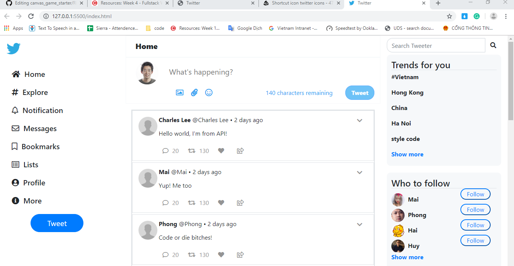

# CoderSchool FTW - Twitter

Created with love by: Team 1

### View online at [here](https://determined-turing-e577a7.netlify.com/#)

### Required User Stories

- [x] The user should be able to enter a message into a text field. 
- [x] The user should be able to press "Tweet" and see the message pop in below the text box. 
- [x] The user should see a "count" that displays how many more characters the user has remaining, counting down from 140. 
- [x] Upon tweeting, the characters remaining text should reset back to 140, and the field should be cleared. 
- [x] The application should disallow text of greater than 140 characters. 
- [x] The user should be able to "Retweet". Clicking Retweet immediately inserts a copy of that tweet below the original tweet.
- [x] The user should be able to "Like". When "Like" is clicked, the text should change to "Unlike".  When "Unlike" is clicked, the text should change to "Like". Alternatively, use a heart icon (colored or not colored). 
- [x] When a "Liked" tweet is retweeted, the new tweet should not be liked. 
- [x] Each tweet has an optional hashtag. The hashtag should be linked with an anchor tag. 
- [x] The user should be able to delete a tweet.

Optional Stories
- [x] Download and upload the list of tweets using the myjson api, as shown in class.
- [x] Users can mention other users. Any string that starts with @username will be highlighted in blue.
- [x] The user can click on a hashtag, and only other tweets with that hashtag are shown.
- [x] When the user deletes a tweet, all retweets should be deleted.
- [x] Any tweet with an image URL will have the image automatically expanded in the tweet.

### things to improve:

#### functions
* change order of tweets by newest first
* API Myjson may not be able to save html syntax (tweet.body) -> might need to save only the tweet plain-text content to tweet.body and find a way to deploy

#### design
* responsive optimized